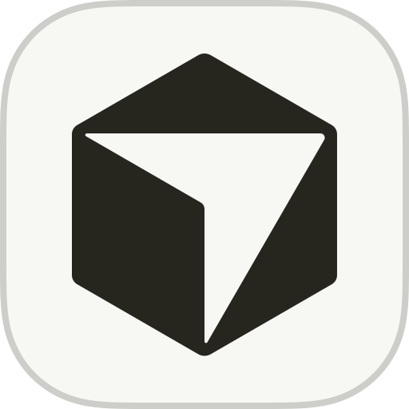
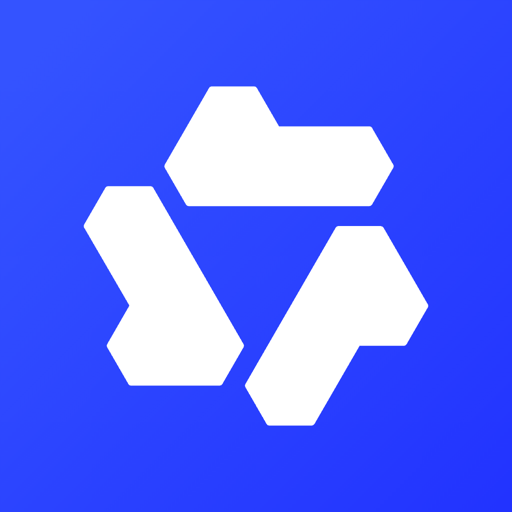

# AI Worlds

> 说明：除原作者仓库提供的 `Alma + qwen3.8-flash` 案例外，同一 Agent 与模型使用同一套提示词独立生成两个版本，用于观察生成结果的差异与稳定性；V1 与 V2 代表两次独立生成，不代表版本迭代。

不同 Agent 与模型，用 Web 前端技术描述各自心目中的世界。 [GitHub Pages 在线预览 ](https://yalin28.github.io/ai-worlds/)

## 统一提示词

所有案例使用同一套提示词：

```text
用 Web 前端技术描述「你心目中的世界」，产物为单文件 HTML、零依赖，可直接运行。
```

## AI 世界

| Agent / 工具 | 模型 | 入口 |
| --- | --- | --- |
| <span style="display: inline-flex; align-items: center; gap: 6px; vertical-align: middle; line-height: 1;"> Cursor</span> | <span style="display: inline-flex; align-items: center; gap: 6px; vertical-align: middle; line-height: 1;"> Claude-Opus-5-High</span> | [V1 ](https://yalin28.github.io/ai-worlds/Cursor-Claude-Opus-5-High/) ｜ [V2 ](https://yalin28.github.io/ai-worlds/Cursor-Claude-Opus-5-High-V2/) |
| <span style="display: inline-flex; align-items: center; gap: 6px; vertical-align: middle; line-height: 1;"> Alma</span> | <span style="display: inline-flex; align-items: center; gap: 6px; vertical-align: middle; line-height: 1;"> qwen3.8-flash</span> | [V1 ](https://yalin28.github.io/ai-worlds/Alma-qwen3.8-flash/) · [原作者仓库 ](https://github.com/adfoke/myworld) |
| <span style="display: inline-flex; align-items: center; gap: 6px; vertical-align: middle; line-height: 1;"> WorkBuddy</span> | <span style="display: inline-flex; align-items: center; gap: 6px; vertical-align: middle; line-height: 1;"> AI-Hy4-Preview</span> | [V1 ](https://yalin28.github.io/ai-worlds/WorkBuddy-AI-Hy4-Preview/) ｜ [V2 ](https://yalin28.github.io/ai-worlds/WorkBuddy-AI-Hy4-Preview-V2/) |
| <span style="display: inline-flex; align-items: center; gap: 6px; vertical-align: middle; line-height: 1;"> Codex</span> | <span style="display: inline-flex; align-items: center; gap: 6px; vertical-align: middle; line-height: 1;"> GPT-5.6-Sol-Max</span> | [V1 ](https://yalin28.github.io/ai-worlds/Codex-GPT-5.6-Sol-Max/) ｜ [V2 ](https://yalin28.github.io/ai-worlds/Codex-GPT-5.6-Sol-Max-V2/) |
| <span style="display: inline-flex; align-items: center; gap: 6px; vertical-align: middle; line-height: 1;"> ZCode</span> | <span style="display: inline-flex; align-items: center; gap: 6px; vertical-align: middle; line-height: 1;"> GLM-5.3-Flash-Max</span> | [V1 ](https://yalin28.github.io/ai-worlds/ZCode-GLM-5.3-Flash-Max/) ｜ [V2 ](https://yalin28.github.io/ai-worlds/ZCode-GLM-5.3-Flash-Max-V2/) |
| <span style="display: inline-flex; align-items: center; gap: 6px; vertical-align: middle; line-height: 1;"> DeepSeek Harness</span> | <span style="display: inline-flex; align-items: center; gap: 6px; vertical-align: middle; line-height: 1;"> DeepSeek-V4-Pro-Max</span> | [V1 ](https://yalin28.github.io/ai-worlds/DeepSeek-Harness%20-DeepSeek-V4-Pro-Max/) ｜ [V2 ](https://yalin28.github.io/ai-worlds/DeepSeek-Harness%20-DeepSeek-V4-Pro-Max-V2/) |
| <span style="display: inline-flex; align-items: center; gap: 6px; vertical-align: middle; line-height: 1;"> Cursor</span> | <span style="display: inline-flex; align-items: center; gap: 6px; vertical-align: middle; line-height: 1;"> Grok-4.6-High</span> | [V1 ](https://yalin28.github.io/ai-worlds/Cursor-Grok-4.6-High/) ｜ [V2 ](https://yalin28.github.io/ai-worlds/Cursor-Grok-4.6-High-V2/) |
| <span style="display: inline-flex; align-items: center; gap: 6px; vertical-align: middle; line-height: 1;"> 千问</span> | <span style="display: inline-flex; align-items: center; gap: 6px; vertical-align: middle; line-height: 1;"> Qwen-3.8-Max</span> | [V1 ](https://yalin28.github.io/ai-worlds/Qianwen-Qwen-3.8-Max/) ｜ [V2 ](https://yalin28.github.io/ai-worlds/Qianwen-Qwen-3.8-Max-V2/) |
| <span style="display: inline-flex; align-items: center; gap: 6px; vertical-align: middle; line-height: 1;"> ZCode</span> | <span style="display: inline-flex; align-items: center; gap: 6px; vertical-align: middle; line-height: 1;"> GLM-5.3-Max</span> | [V1 ](https://yalin28.github.io/ai-worlds/ZCode-GLM-5.3-Max/) ｜ [V2 ](https://yalin28.github.io/ai-worlds/ZCode-GLM-5.3-Max-V2/) |
| <span style="display: inline-flex; align-items: center; gap: 6px; vertical-align: middle; line-height: 1;"> Cursor</span> | <span style="display: inline-flex; align-items: center; gap: 6px; vertical-align: middle; line-height: 1;"> Kimi-K3-Max</span> | [V1 ](https://yalin28.github.io/ai-worlds/Cursor-Kimi-K3-Max/) ｜ [V2 ](https://yalin28.github.io/ai-worlds/Cursor-Kimi-K3-Max-V2/) |
| <span style="display: inline-flex; align-items: center; gap: 6px; vertical-align: middle; line-height: 1;"> Antigravity</span> | <span style="display: inline-flex; align-items: center; gap: 6px; vertical-align: middle; line-height: 1;"> Gemini-3.7-Flash-High</span> | [V1 ](https://yalin28.github.io/ai-worlds/Antgrivity-Gemini-3.7Flash/) ｜ [V2 ](https://yalin28.github.io/ai-worlds/Antigravity-Gemini-3.7-Flash-High-V2/) |

> 品牌图标仅用于标识对应 Agent、工具与模型，不代表任何官方合作或背书。

## 灵感来源

本项目的灵感来源于 [adfoke/myworld ](https://github.com/adfoke/myworld)，`Alma + qwen3.8-flash` 的案例为原仓库内容。
